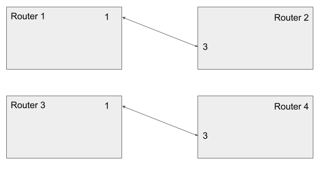
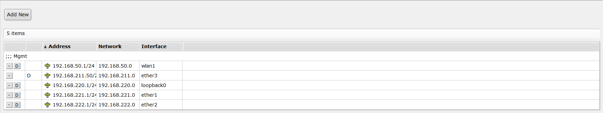
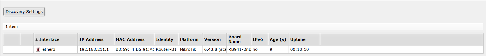
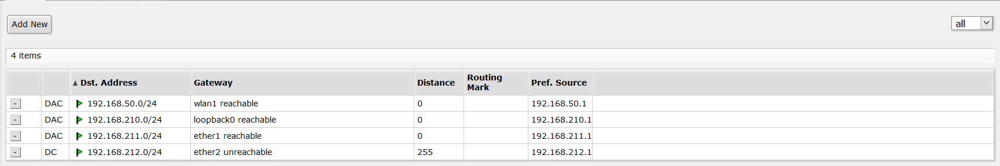
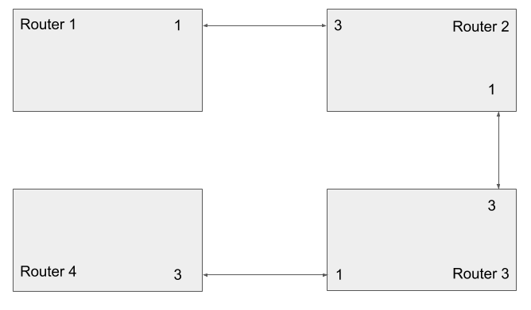
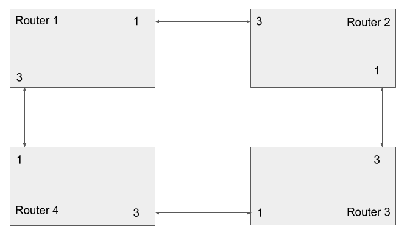
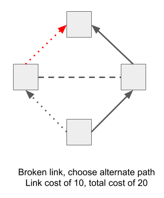
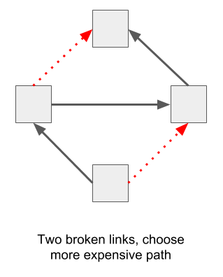

# UUG Routing Lab

* [Step 0 - Booting up](#step-0)
* [Step 1 - Connecting to a friend](#step-1)
* [Step 2 - Establishing dynamic routing](#step-2)
* [Step 3 - Redundant paths](#step-3)
* [Step 4 - Path costs](#step-4)
* [Step 5 - Breaking things](#step-5)

## Background Information

* DHCP
* OSPF?
* RFC 1918
* Route - gateway, subnet
* Subnet

## Step 0
For this lab, we're building a network with dynamic routing. We have eight
routers, so break yourself into eight teams and take a router. These routers are
small Linux powered devices [made by MikroTik](https://mikrotik.com/product/RB941-2nD-TC).
For the first few steps, we'll build two separate networks as an `A` and `B` team.

Once you've chosen a router and powered it up, connect to its wireless network.
All of the routers can be managed by browsing http://192.168.50.1. The
username is `admin` with no password.

Take a moment to explore the MikroTik web interface (though they also have an
SSH interface with a similar structure). Pay particular attention to these pages:

* Interfaces
* IP -> Addresses
* IP -> Neighbors
* IP -> Routes
* Routing -> OSPF
* Tools -> Ping
* Tools -> Traceroute

These routers come preconfigured to act much like you'd expect of a home router,
ie one Internet/WAN port, several internal/LAN ports, wireless connected to the
internal side, address translation (NAT) to rewrite internal IP addresses to a
single outside address, and a handful of firewall rules to filter out malicious
traffic. Most of that has been deleted, and replaced with a configuration that
accelerates this lab, and more closely resembles an Internet backbone router.

Each port will need to be configured with its own address and subnet. Ports 1
and 2 have been configured as shown on the router's label sticker. They also have
a DHCP Server configured, that will hand out addresses to anyone who connects to
that port. Ports 3 and 4 have been configured as DHCP clients, so they will try
to request an address from the other end of the cable.

**Important: to keep things simple, make sure to connect Port 1 or 2 to Port 3 or 4.**

## Step 1
Now we're going to build four tiny networks. If you have Router 1, find the
corresponding Router 3, if you have Router 2, find Router 4. As mentioned above,
you want to connect Port 1 to Port 3, as shown here:

Now let's look around RouterOS and make sure it understands what we've done.
Start with the `Interfaces` page, where you should see an `R` next to the
connected port. On Router 2 and 4 *only* go to the `IP -> Addresses` page to
confirm that you've received an address from DHCP. Give that address to your
router friend and ask them to ping it. Also try to ping the `192.168.xxx.1`
address.

### Dynamic Address

### Neighbor Discovery

Go to the `IP -> Routes` page and note that you should have a `Connected` route.

## Step 2
At this point, connect Router 2 to Router 3 following the Port 1 to 3 rule, as
shown below. Visit the pages from Step 1 to see the current state of the network.
`Interfaces` should show the correct connections. `IP -> Addresses` should show
an address on all connected ports. `IP -> Routes` should show several `Connected`
routes.

Now let's discover a small problem with our network. Since we only have `Connected`
routes, ping will only work over one hop. You can ping from Router 1 to 2, 2 to 3,
or 3 to 4. However, you can't ping over two hops, such as from Router 1 to 3, or
2 to 4. Try this!

## Step 3

## Step 4

## Step 5
Breaking things!

