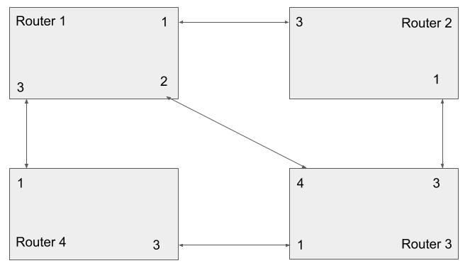
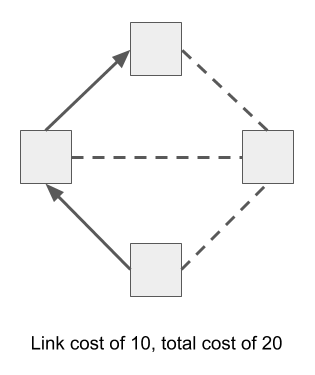

# UUG Routing Lab

## Background Information

* DHCP
* OSPF?
* RFC 1918
* Route - gateway, subnet
* Subnet

## Step 0
For this lab, we're building a network with dynamic routing. We have eight
routers, so break yourself into eight teams and take a router. These routers are
small Linux powered devices [made by MikroTik](https://mikrotik.com/product/RB941-2nD-TC).
For the first few steps, we'll build two separate networks as an `A` and `B` team.

Once you've chosen a router and powered it up, connect to its wireless network.
All of the routers can be managed by browsing http://192.168.50.1. The
username is `admin` with no password.

Take a moment to explore the MikroTik web interface (though they also have an
SSH interface with a similar structure). Pay particular attention to these pages:

* Interfaces
* IP -> Addresses
* IP -> Neighbors
* IP -> Routes
* Routing -> OSPF
* Tools -> Ping
* Tools -> Traceroute

These routers come preconfigured to act much like you'd expect of a home router,
ie one Internet/WAN port, several internal/LAN ports, wireless connected to the
internal side, address translation (NAT) to rewrite internal IP addresses to a
single outside address, and a handful of firewall rules to filter out malicious
traffic. Most of that has been deleted, and replaced with a configuration that
accelerates this lab, and more closely resembles an Internet backbone router.

Each port will need to be configured with its own address and subnet. Ports 1
and 2 have been configured as shown on the router's label sticker. They also have
a DHCP Server configured, that will hand out addresses to anyone who connects to
that port. Ports 3 and 4 have been configured as DHCP clients, so they will try
to request an address from the other end of the cable.

**Important: to keep things simple, make sure to connect Port 1 or 2 to Port 3 or 4.**

## Step 1

## Step 2

## Step 3

## Step 4

## Step 5

## Step 6

## Step 7

